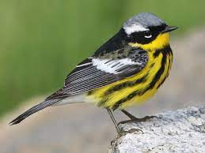
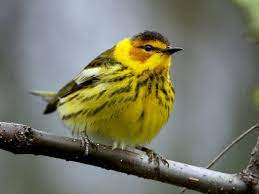
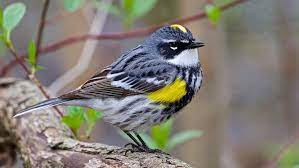
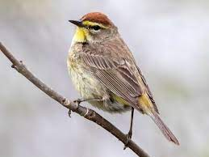
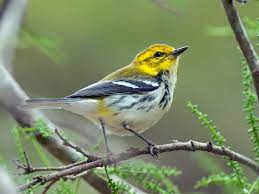

```{r setup, include=FALSE}
knitr::opts_chunk$set(echo = TRUE)

library(rgbif)
library(tidyverse)
library(MuMIn)
library(rnoaa)
library(data.table)
library(ggmap)
library(usmap)
library(lme4)
library(car)
library(cowplot)
library(knitr)
library(dplyr)
library(kableExtra)
```


<!-- for comments -->
<style>
div.comment pre { background-color:#ffbbbb; }
div.comment pre.r { background-color:#ffbbbb; }
div.comment {color: red;}
</style>


<div class="comment">

```{r,include=FALSE}
grade <- 150
```

</div>

## Introduction
Trans-Gulf migrants (TGMs) are species that migrate from Central and South America and land between Texas and Florida looking for areas to forage and breed. The specific time in which they land is imperative to their longevity, as arriving early could increase chances of finding a mate and increase time for mating, while arriving later would secure food availability.
Population displacement is becoming a serious concern as migration patterns are being disrupted by the increasing severity of climate change, requiring the TGMs to alter the timing of their migration in order to access the same resources as they normally would. TGMs also rely on the environmental cues by stop over points throughout their trip to ensure that the migration will go smoothly, and the longer the migration trip, the less impact a shorter length shift in their departure date will have according to @carey2009the. 
To measure the effects of local weather conditions on TGM arrival time in Massachusetts, a program called eBird will be used for bird ecology data in tandem with meteorological data.
In this project we will study the following five species: Magnolia warbler (Setophaga magnolia), Cape May warbler (Setophaga tigrina), Yellow-rumped warbler (Setophaga coronata), Palm warbler (Setophaga palmarum), and Black-throated Green warbler (Setophaga virens).


```{r, "Magnolia Info",echo=FALSE,warning=FALSE,message=FALSE,out.width='70%',fig.align='right',fig.cap='Fig. 1.A. Records for Magnolia warbler in Massachussets, 2019.'}

magnolia <- occ_data(scientificName = "Setophaga magnolia", stateProvince="Massachusetts", limit=200,year=2019)
cape <- occ_data(scientificName = "Setophaga tigrina", stateProvince="Massachusetts", limit=200,year=2019)
yellow <- occ_data(scientificName = "Setophaga coronata", stateProvince="Massachusetts", limit=200,year=2019)
palm <- occ_data(scientificName = "Setophaga palmarum", stateProvince="Massachusetts", limit=200,year=2019)
black <- occ_data(scientificName = "Setophaga virens", stateProvince="Massachusetts", limit=200,year=2019)

MA<- map_data('state', 'massachusetts')

magnolia.p <- ggplot(MA, aes(long,lat,group=subregion) )+
  geom_polygon(colour = "gray",fill="gray90")+geom_point(data=magnolia[[2]],aes(x=decimalLongitude,y=decimalLatitude,size=individualCount),alpha=0.3,inherit.aes = F)+ coord_quickmap()+theme_void()
cape.p <- ggplot(MA, aes(long,lat,group=subregion) )+
  geom_polygon(colour = "gray",fill="gray90")+geom_point(data=cape[[2]],aes(x=decimalLongitude,y=decimalLatitude,size=individualCount),alpha=0.3,inherit.aes = F)+ coord_quickmap()+theme_void()
yellow.p <- ggplot(MA, aes(long,lat,group=subregion) )+
  geom_polygon(colour = "gray",fill="gray90")+geom_point(data=yellow[[2]],aes(x=decimalLongitude,y=decimalLatitude,size=individualCount),alpha=0.3,inherit.aes = F)+ coord_quickmap()+theme_void()
palm.p <- ggplot(MA, aes(long,lat,group=subregion) )+
  geom_polygon(colour = "gray",fill="gray90")+geom_point(data=palm[[2]],aes(x=decimalLongitude,y=decimalLatitude,size=individualCount),alpha=0.3,inherit.aes = F)+ coord_quickmap()+theme_void()
black.p <- ggplot(MA, aes(long,lat,group=subregion) )+
  geom_polygon(colour = "gray",fill="gray90")+geom_point(data=black[[2]],aes(x=decimalLongitude,y=decimalLatitude,size=individualCount),alpha=0.3,inherit.aes = F)+ coord_quickmap()+theme_void()

magnolia.p2 <- ggdraw()+ draw_plot(magnolia.p)
print(magnolia.p2)

```


```{r, "Cape May Info",echo=FALSE,warning=FALSE,message=FALSE,out.width='70%',fig.align='right',fig.cap='Fig. 1.B. Records for Cape May warbler in Massachussets, 2019.'}
cape.p2 <- ggdraw() +draw_plot(cape.p)
print(cape.p2)
```


```{r, "Yellow-rumped Info",echo=FALSE,warning=FALSE,message=FALSE,out.width='70%',fig.align='right',fig.cap='Fig. 1.C. Records for Yellow-rumped warbler in Massachussets, 2019.'}
yellow.p2 <- ggdraw() + draw_plot(yellow.p)
print(yellow.p2)
```


```{r, "Palm Info",echo=FALSE,warning=FALSE,message=FALSE,out.width='70%',fig.align='right',fig.cap='Fig. 1.D. Records for Palm warbler in Massachussets, 2019.'}
palm.p2 <- ggdraw() +draw_plot(palm.p)
print(palm.p2)
```


```{r, "Black-throated Info",echo=FALSE,warning=FALSE,message=FALSE,out.width='70%',fig.align='right',fig.cap='Fig. 1.E. Records for Black-throated Green warbler in Massachussets, 2019.'}
black.p2 <- ggdraw() +draw_plot(black.p)
print(black.p2)
```

## Methods
After choosing what species of TGMs to study, occurence data from an rgbif function will be used to grab data for each species. NOAA's NCDC API will be used to locate weather stations specific locations throughout the birds trip to Boston. Then, a function called meteo_pull_monitors() will be used to grab weather data from these stations.
Finding the day where 25% of all the individuals of a species has arrived constitutes the "arrival time", and the rest of the species that arrive will follow a logistic curve, modeled with a logistic model in R. After finding the weather data for these dates along the migration path of the species, a rolling mean function will help find the mean of the weather data over 2 weeks before each Julian day. A linear mixed-effect model will allow for analysis of many factors that may affect the relationship between arrival time and local weather. An ANOVA is run over the models to find a best fit model of the data. 

## Results

```{r, "Ebird Set up",include=FALSE,cache=TRUE,results=TRUE,eval=FALSE}
species <- c("Setophaga magnolia","Setophaga tigrina","Setophaga coronata","Setophaga palmarum","Setophaga virens")

y <- paste0("1999",",","2019")
m <- paste0("3",",","6")

dat.l <-list()

for(s in species){
  n.obs <-  occ_data(scientificName = s, year = y, month = m, limit = 0, country = "US", basisOfRecord = "HUMAN_OBSERVATION", stateProvince="Massachusetts")$meta$count 

print(n.obs)

dat.l[[paste0(s)]] <- occ_data(scientificName = s, year = y, month = m, 
                               limit = n.obs, country = "US",
                               basisOfRecord = "HUMAN_OBSERVATION",
                               stateProvince = "Massachusetts")[[2]]

}

saveRDS(dat.l,"massbird.data.RDS")
```

```{r}
dat <- readRDS("massbird.data.RDS")
dat <- rbindlist(dat,fill=T)
head(dat)

dat%>%
  group_by(year, species)%>%
  summarise(count=sum(individualCount,na.rm = T))%>%
  ggplot(aes(x=year,y=count,col=species))+geom_point()

```

<div class="comment">
I would have broken this chunk up: first, one with `eval=FALSE` that includes the loop, the next one that reads in the data produced from the loop.

</div>

```{r, "Weather Set up",echo=FALSE,warning=FALSE,message=FALSE,fig.cap='Fig. 2. Weather sampling locations for this project.'}

options(noaakey = "MNNiOTQiqymUOFxyhavrXdSobVKuKJyr")

sts <- c(
  "GHCND:USW00013894", #Mobile
  "GHCND:USW00013881", #Charlotte
  "GHCND:USW00014739" #Boston
)

#making one table w/ info about location of the stations
sta.d <- bind_rows( #bind the rows
  lapply(sts,function(x) ncdc_stations(stationid = x)$data ) #use lapply to run through stations
  )%>%
  mutate(usmap_transform(.,input_names = c("longitude","latitude"),output_names = c("longitude.1", "latitude.1")))%>% #join transformation of lat/long for projection with usmap
  mutate(name=str_sub(name, -5,-4))%>%#simplify the name column, grab just the state
  mutate(migr.day=c(10,5,0))%>% #so we can look at wind speed 0, 5 or 10 days before arrive in boston
  separate(id,into = c("station.type","id"))%>%#need to cut station type out from station id number
        print()

#plotting the image of where the stations are
plot_usmap(
  include = c(.northeast_region,.south_region,.east_north_central)
)+geom_point(data=sta.d,aes(x=longitude.1,y=latitude.1,col=name),size=5)+geom_label(data=sta.d,aes(x=longitude.1,y=latitude.1,col=name,label=name),size=5,nudge_x = 1e6*0.25)+theme(legend.position = "none")

#getting  weather info and print table 
weather.d <- meteo_pull_monitors(sta.d$id,date_min = "2000-01-01")
```

First, a data set was created by collecting data for each of our species between 2000 and 2020 to allow to analyze eBird data. Then, another data set was created using NOAA's NCDC API, collecting weather data in the between the years 2000 and 2020, in three different regions of the USA. The weather sampling locations are shown above, and were chosen to reflect the path of TGMs.

```{r, "EBird Data Modeling For Magnolia Warbler (sm)",echo=FALSE,warning=FALSE,message=FALSE,out.width = "50%",fig.show='hold'}
sm<- dat%>%
  filter(species == "Setophaga magnolia")%>%
  group_by(year)%>%
  mutate(date=as.Date(paste0(year,"-",month,"-",day)),
         j.day=julian(date,origin=as.Date(paste0(unique(year),"-01-01")))
  )%>%
  group_by(species,year,j.day,date)%>%
  summarise(day.tot=sum(individualCount,na.rm=T))%>%
  group_by(species,year)%>%
  mutate(prop=cumsum(day.tot/sum(day.tot,na.rm = T)))%>%
  filter(year>1999)

sm%>%
  ggplot(aes(j.day,prop))+geom_point()+facet_wrap(year~.)

sm.pred <- sm%>%
  group_by(year)%>%
 summarize(
   pred=predict(nls(prop~SSlogis(j.day,Asym, xmid, scal)),newdata=data.frame(j.day=min(j.day):max(j.day))),#predict the logistic curve for each species
   j.day=min(j.day):max(j.day),
  )%>%
  left_join(sm%>%dplyr::select(j.day,date))

sm%>%
  ggplot(aes(j.day,prop))+geom_point(aes=0.3)+geom_line(data=sm.pred,aes(x=j.day,y=pred),col="blue",size=2)+facet_wrap(year~.)

sm.arrive.date <-sm.pred%>%
  group_by(year)%>%
  filter(j.day==j.day[which.min(abs(pred-0.25))])

sm.arrive.date%>%
  ggplot(aes(year,j.day))+geom_point()

```

The plots above show that 25% of the population of Magnolia warblers arrived between the Julian days 130 and 136.

```{r, "EBird Data Modeling For Cape May Warbler (st)",echo=FALSE,warning=FALSE,message=FALSE,out.width = "50%",fig.show='hold'}
st<- dat%>%
  filter(species == "Setophaga tigrina")%>%
  group_by(year)%>%
  mutate(date=as.Date(paste0(year,"-",month,"-",day)),
         j.day=julian(date,origin=as.Date(paste0(unique(year),"-01-01")))
  )%>%
  group_by(species,year,j.day,date)%>%
  summarise(day.tot=sum(individualCount,na.rm=T))%>%
  group_by(species,year)%>%
  mutate(prop=cumsum(day.tot/sum(day.tot,na.rm = T)))%>%
  filter(year>1999)

st%>%
  ggplot(aes(j.day,prop))+geom_point()+facet_wrap(year~.)

st.pred <- st%>%
  group_by(year)%>%
 summarize(
   pred=predict(nls(prop~SSlogis(j.day,Asym, xmid, scal)),newdata=data.frame(j.day=min(j.day):max(j.day))),#predict the logistic curve for each species
   j.day=min(j.day):max(j.day),
  )%>%
  left_join(st%>%dplyr::select(j.day,date))

st%>%
  ggplot(aes(j.day,prop))+geom_point(aes=0.3)+geom_line(data=st.pred,aes(x=j.day,y=pred),col="blue",size=2)+facet_wrap(year~.)

st.arrive.date <-st.pred%>%
  group_by(year)%>%
  filter(j.day==j.day[which.min(abs(pred-0.25))])

st.arrive.date%>%
  ggplot(aes(year,j.day))+geom_point()

```

The plots above show that 25% of the population of Cape May warblers arrived between the Julian days 125 and 133.

```{r, "EBird Data Modeling For Yellow-Rumped Warbler (sc)",echo=FALSE,warning=FALSE,message=FALSE,out.width = "50%",fig.show='hold'}
sc<- dat%>%
  filter(species == "Setophaga coronata")%>%
  group_by(year)%>%
  mutate(date=as.Date(paste0(year,"-",month,"-",day)),
         j.day=julian(date,origin=as.Date(paste0(unique(year),"-01-01")))
  )%>%
  group_by(species,year,j.day,date)%>%
  summarise(day.tot=sum(individualCount,na.rm=T))%>%
  group_by(species,year)%>%
  mutate(prop=cumsum(day.tot/sum(day.tot,na.rm = T)))%>%
  filter(year>1999)

sc%>%
  ggplot(aes(j.day,prop))+geom_point()+facet_wrap(year~.)

sc.pred <- sc%>%
  group_by(year)%>%
 summarize(
   pred=predict(nls(prop~SSlogis(j.day,Asym, xmid, scal)),newdata=data.frame(j.day=min(j.day):max(j.day))),#predict the logistic curve for each species
   j.day=min(j.day):max(j.day),
  )%>%
  left_join(sc%>%dplyr::select(j.day,date))

sc%>%
  ggplot(aes(j.day,prop))+geom_point(aes=0.3)+geom_line(data=sc.pred,aes(x=j.day,y=pred),col="blue",size=2)+facet_wrap(year~.)

sc.arrive.date <-sc.pred%>%
  group_by(year)%>%
  filter(j.day==j.day[which.min(abs(pred-0.25))])

sc.arrive.date%>%
  ggplot(aes(year,j.day))+geom_point()

```

The plots above show that 25% of the population of Yellow-rumped warblers arrived between the Julian days 114 and 121.

```{r, "EBird Data Modeling For Palm Warbler (sp)",echo=FALSE,warning=FALSE,message=FALSE,out.width = "50%",fig.show='hold'}
sp<- dat%>%
  filter(species == "Setophaga palmarum")%>%
  group_by(year)%>%
  mutate(date=as.Date(paste0(year,"-",month,"-",day)),
         j.day=julian(date,origin=as.Date(paste0(unique(year),"-01-01")))
  )%>%
  group_by(species,year,j.day,date)%>%
  summarise(day.tot=sum(individualCount,na.rm=T))%>%
  group_by(species,year)%>%
  mutate(prop=cumsum(day.tot/sum(day.tot,na.rm = T)))%>%
  filter(year>1999)

sp%>%
  ggplot(aes(j.day,prop))+geom_point()+facet_wrap(year~.)

sp.pred <- sp%>%
  group_by(year)%>%
 summarize(
   pred=predict(nls(prop~SSlogis(j.day,Asym, xmid, scal)),newdata=data.frame(j.day=min(j.day):max(j.day))),#predict the logistic curve for each species
   j.day=min(j.day):max(j.day),
  )%>%
  left_join(sp%>%dplyr::select(j.day,date))

sp%>%
  ggplot(aes(j.day,prop))+geom_point(aes=0.3)+geom_line(data=sp.pred,aes(x=j.day,y=pred),col="blue",size=2)+facet_wrap(year~.)

sp.arrive.date <-sp.pred%>%
  group_by(year)%>%
  filter(j.day==j.day[which.min(abs(pred-0.25))])

sp.arrive.date%>%
  ggplot(aes(year,j.day))+geom_point()

```

The plots above show that 25% of the population of Palm warblers arrived between the Julian days 103 and 112.

```{r, "EBird Data Modeling For Black-Throated Green Warbler (sv)",echo=FALSE,warning=FALSE,message=FALSE,out.width = "50%",fig.show='hold'}
sv<- dat%>%
  filter(species == "Setophaga virens")%>%
  group_by(year)%>%
  mutate(date=as.Date(paste0(year,"-",month,"-",day)),
         j.day=julian(date,origin=as.Date(paste0(unique(year),"-01-01")))
  )%>%
  group_by(species,year,j.day,date)%>%
  summarise(day.tot=sum(individualCount,na.rm=T))%>%
  group_by(species,year)%>%
  mutate(prop=cumsum(day.tot/sum(day.tot,na.rm = T)))%>%
  filter(year>1999)

sv%>%
  ggplot(aes(j.day,prop))+geom_point()+facet_wrap(year~.)

sv.pred <- sv%>%
  group_by(year)%>%
 summarize(
   pred=predict(nls(prop~SSlogis(j.day,Asym, xmid, scal)),newdata=data.frame(j.day=min(j.day):max(j.day))),#predict the logistic curve for each species
   j.day=min(j.day):max(j.day),
  )%>%
  left_join(sv%>%dplyr::select(j.day,date))

sv%>%
  ggplot(aes(j.day,prop))+geom_point(aes=0.3)+geom_line(data=sv.pred,aes(x=j.day,y=pred),col="blue",size=2)+facet_wrap(year~.)

sv.arrive.date <-sv.pred%>%
  group_by(year)%>%
  filter(j.day==j.day[which.min(abs(pred-0.25))])

sv.arrive.date%>%
  ggplot(aes(year,j.day))+geom_point()

```

The plots above show that 25% of the population of Black-throated Green warblers arrived between the Julian days 125 and 131.

```{r, "Weather Data Prep",include=FALSE,warning=FALSE,message=FALSE}
#single day data
weather.d <- weather.d%>%
  mutate(year=as.integer(str_sub(date,1,4)),
         date=as.Date(date))%>%
  group_by(year)%>%
 mutate(j.day=julian(date,origin=as.Date(paste0(unique(year),"-01-01"))),
  date2=date,
  wdir.rad=(180-abs(wdf2-180))*pi/180, 
  wvec=cos(wdir.rad)*-1*awnd
  )%>% 
  dplyr::select(id,year,date2,j.day,tmin,tmax,wvec)%>% 
  left_join(sta.d%>%select(id,name,migr.day))%>% 
  mutate(j.day=j.day+migr.day)

#2 week mean data
weather.wk <-weather.d %>% 
  group_by(year,name) %>% 
  mutate(wk.tmin = frollmean(tmin, n=14,align="right"),
         wk.tmax = frollmean(tmax, n=14,align="right"),
         wk.wvec = frollmean(wvec, n=14,align="right")
         )%>%
  dplyr::select(j.day,date2,name,wk.tmin,wk.tmax,wk.wvec)
```

```{r, "eBird and weather data joinnig for Magnolia Warbler",include=FALSE,warning=FALSE,message=FALSE}
sm.arr.weath <- sm.arrive.date%>%
  left_join(weather.d)%>%
  left_join(sm%>%dplyr::select(year,date,j.day))
head(sm.arr.weath)

sm.arr.weath2 <- sm.arrive.date%>%
  left_join(weather.wk)
head(sm.arr.weath2)
```

```{r, "eBird and weather data joinnig for Cape May Warbler",include=FALSE,warning=FALSE,message=FALSE}
st.arr.weath <- st.arrive.date%>%
  left_join(weather.d)%>%
  left_join(st%>%dplyr::select(year,date,j.day))
head(st.arr.weath)

st.arr.weath2 <- st.arrive.date%>%
  left_join(weather.wk)
head(st.arr.weath2)
```

```{r, "eBird and weather data joinnig for Yellow-Rumped Warbler",include=FALSE,warning=FALSE,message=FALSE}
sc.arr.weath <- sc.arrive.date%>%
  left_join(weather.d)%>%
  left_join(sc%>%dplyr::select(year,date,j.day))
head(sc.arr.weath)

sc.arr.weath2 <- sc.arrive.date%>%
  left_join(weather.wk)
head(sc.arr.weath2)
```

```{r, "eBird and weather data joinnig for Palm Warbler",include=FALSE,warning=FALSE,message=FALSE}
sp.arr.weath <- sp.arrive.date%>%
  left_join(weather.d)%>%
  left_join(sp%>%dplyr::select(year,date,j.day))
head(sp.arr.weath)

sp.arr.weath2 <- sp.arrive.date%>%
  left_join(weather.wk)
head(sp.arr.weath2)
```

```{r, "eBird and weather data joinnig for Black-Throated Green Warbler",include=FALSE,warning=FALSE,message=FALSE}
sv.arr.weath <- sv.arrive.date%>%
  left_join(weather.d)%>%
  left_join(sv%>%dplyr::select(year,date,j.day))
head(sv.arr.weath)

sv.arr.weath2 <- sv.arrive.date%>%
  left_join(weather.wk)
head(sv.arr.weath2)
```

After analyzing both the eBird and weather data, linear mixed-effect modelling was conducted for the five species of birds.

```{r, "Linear Mixed-Effect Modelling for Magnolia Warbler",echo=FALSE,warning=FALSE,message=FALSE}

#weather at 0, 5, and 10 days away from arrival
sm.lmer <- lmer(j.day~tmin*tmax*wvec+(1|name),sm.arr.weath,na.action = "na.fail")
Anova(sm.lmer) 

#0Mean two week weather preceding arrival
sm.lmer2 <- lmer(j.day~wk.tmin*wk.tmax*wk.wvec+(1|name),sm.arr.weath2,na.action = "na.fail")
Anova(sm.lmer2) 

sm.arr.aic <- dredge(sm.lmer2,fixed = c("wk.tmin","wk.tmax","wk.wvec"),)

sm.kb <- kable(sm.arr.aic[1:4,],caption = "Fit values for nested models of the most complicated lme model")

kable_styling(sm.kb)

best.lmer <-  lmer(j.day~wk.tmin+wk.tmax+wk.wvec+(1|name),sm.arr.weath2,na.action = "na.fail")

Anova(best.lmer)
```
Based on the analysis shown above for the Magnolia warbler, a model including minimum and maximum temperature as well as wind vector explains the data best. The ANOVA test shows no significant predictors.

```{r, "Linear Mixed-Effect Modelling for Cape May Warbler",echo=FALSE,warning=FALSE,message=FALSE}

#weather at 0, 5, and 10 days away from arrival
st.lmer <- lmer(j.day~tmin*tmax*wvec+(1|name),st.arr.weath,na.action = "na.fail")
Anova(st.lmer)

#0Mean two week weather preceding arrival
st.lmer2 <- lmer(j.day~wk.tmin*wk.tmax*wk.wvec+(1|name),st.arr.weath2,na.action = "na.fail")
Anova(st.lmer2) 
st.arr.aic <- dredge(st.lmer2,fixed = c("wk.tmin","wk.tmax","wk.wvec"),)

st.kb <- kable(st.arr.aic[1:4,],caption = "Fit values for nested models of the most complicated lme model")

kable_styling(st.kb)

best.lmer <-  lmer(j.day~wk.tmin+wk.tmax+wk.wvec+(1|name),st.arr.weath2,na.action = "na.fail")

Anova(best.lmer)
```
Based on the analysis shown above for the Cape May warbler, a model including minimum and maximum temperature as well as wind vector explains the data best. The ANOVA test shows no significant predictors.

```{r, "Linear Mixed-Effect Modelling for Yellow-Rumped Warbler",echo=FALSE,warning=FALSE,message=FALSE}

#weather at 0, 5, and 10 days away from arrival
sc.lmer <- lmer(j.day~tmin*tmax*wvec+(1|name),sc.arr.weath,na.action = "na.fail")
Anova(sc.lmer) #Anova from the car package

#0Mean two week weather preceding arrival
sc.lmer2 <- lmer(j.day~wk.tmin*wk.tmax*wk.wvec+(1|name),sc.arr.weath2,na.action = "na.fail")
Anova(sc.lmer2) 

sc.arr.aic <- dredge(sc.lmer2,fixed = c("wk.tmin","wk.tmax","wk.wvec"),)

sc.kb <- kable(sc.arr.aic[1:4,],caption = "Fit values for nested models of the most complicated lme model")

kable_styling(sc.kb)

best.lmer <-  lmer(j.day~wk.tmin+wk.tmax+wk.wvec+(1|name),sc.arr.weath2,na.action = "na.fail")

Anova(best.lmer)
```
Based on the analysis shown above for the Yellow-rumped warbler, a model including minimum and maximum temperature as well as wind vector explains the data best. The ANOVA test shows no significant predictors.

```{r, "Linear Mixed-Effect Modelling for Palm Warbler",echo=FALSE,warning=FALSE,message=FALSE}

#weather at 0, 5, and 10 days away from arrival
sp.lmer <- lmer(j.day~tmin*tmax*wvec+(1|name),sp.arr.weath,na.action = "na.fail")
Anova(sp.lmer) #Anova from the car package

#0Mean two week weather preceding arrival
sp.lmer2 <- lmer(j.day~wk.tmin*wk.tmax*wk.wvec+(1|name),sp.arr.weath2,na.action = "na.fail")
Anova(sp.lmer2) 

sp.arr.aic <- dredge(sp.lmer2,fixed = c("wk.tmin","wk.tmax","wk.wvec"),)

sp.kb <- kable(sp.arr.aic[1:4,],caption = "Fit values for nested models of the most complicated lme model")

kable_styling(sp.kb)

best.lmer <-  lmer(j.day~wk.tmin+wk.tmax+wk.wvec+(1|name),sp.arr.weath2,na.action = "na.fail")

Anova(best.lmer)
```
Based on the analysis shown above for the Palm warbler, a model including minimum and maximum temperature as well as wind vector explains the data best. The ANOVA test shows minimum and maximum temperature as significant predictors.

```{r, "Linear Mixed-Effect Modelling for Black-Throated Green Warbler",echo=FALSE,warning=FALSE,message=FALSE}

#weather at 0, 5, and 10 days away from arrival
sv.lmer <- lmer(j.day~tmin*tmax*wvec+(1|name),sv.arr.weath,na.action = "na.fail")
Anova(sv.lmer) #Anova from the car package

#0Mean two week weather preceding arrival
sv.lmer2 <- lmer(j.day~wk.tmin*wk.tmax*wk.wvec+(1|name),sv.arr.weath2,na.action = "na.fail")
Anova(sv.lmer2) 

sv.arr.aic <- dredge(sv.lmer2,fixed = c("wk.tmin","wk.tmax","wk.wvec"),)

sv.kb <- kable(sv.arr.aic[1:4,],caption = "Fit values for nested models of the most complicated lme model")

kable_styling(sv.kb)

best.lmer <-  lmer(j.day~wk.tmin+wk.tmax+wk.wvec+(1|name),sv.arr.weath2,na.action = "na.fail")

Anova(best.lmer)
```
Based on the analysis shown above for the Black-throated Green warbler, a model including minimum and maximum temperature as well as wind vector explains the data best. The ANOVA test shows no significant predictors.

<div class="comment">
This all could have been done in much less code to answer the question. Repeating an analysis for each species misses the point of evaluating the over all pattern.

```{r}
all.dat<- dat%>%
  group_by(species,year)%>%
  mutate(date=as.Date(paste0(year,"-",month,"-",day)),
         j.day=julian(date,origin=as.Date(paste0(unique(year),"-01-01")))
  )%>%
  group_by(species,year,j.day,date)%>%
  summarise(day.tot=sum(individualCount,na.rm=T))%>%
  group_by(species,year)%>%
  mutate(prop=cumsum(day.tot/sum(day.tot,na.rm = T)))%>%
  filter(year>1999)

all.pred <- all.dat%>%
  group_by(species,year)%>%
  summarize(
    pred=predict(nls(prop~SSlogis(j.day,Asym, xmid, scal)),newdata=data.frame(j.day=min(j.day):max(j.day))),
    j.day=min(j.day):max(j.day),
  )%>%
  left_join(all.dat%>%dplyr::select(species,j.day,date))

all.arrive.date <-all.pred%>%
  group_by(species,year)%>%
  filter(j.day==j.day[which.min(abs(pred-0.25))])

all.arr.weath2 <- all.arrive.date%>%
  left_join(weather.wk)

all.lmer <- lmer(j.day~wk.tmin*wk.tmax*wk.wvec+(1|name),all.arr.weath2,na.action = "na.fail")

all.arr.aic <- dredge(all.lmer,fixed = c("wk.tmin","wk.tmax","wk.wvec"),)

best.lmer <-  lmer(j.day~wk.tmin+wk.tmax+wk.wvec+(1|name),all.arr.weath2,na.action = "na.fail")

anova(best.lmer)

grade <- grade-10
```

</div>


## Discussion
  Weather can influence the arrival time for TGMs migrating to MA. In 2004, weather conditions were slightly above average for most of the year, including the Julian days between 120 and 150. That year is also said to be the fourth warmest year on record (US Department of Commerce). Our TGM data for three of our five species show a slightly different graphical display for those dates. Between the years 2000 and 2020, about 100% of our Magnolia Warblers, Cape May Warbler, and Black-Throated Green Warbler birds arrived in Massachusetts by Julian day 140. However, for all three species the 2004 data is an outlier. There appeared to be a delay for the three species in arriving in Massachusetts. There is a possibility that the 2004 higher than normal weather conditions globally confused these birds, delaying their migration patterns as weather does influence a bird’s arrival time.
  For the most part, minus the 2004 data, arrival time did not vary according to the temperature and wind variables along the migration route for the TGMs migrating to MA inspected. Over a span of 20 years, 5 TGMs: Setophaga magnolia, Setophaga tigrina, Setophaga coronata, Setophaga palmarum, Setophaga virens did not appear to have any significant changes within their migration patterns. Their arrival dates for 25% of their population varied only between a few days from year to year and their numbers always appeared to plateau around the same Julian day each year for the 20 recorded years. 

  Though climate change may play a role in the population status of TGMs arriving in MA during the spring, the data collected does not directly reflect climate change’s impact on arrival. All of our bird species data collected has their specific Julian day each year that is closest to 0.25 of the population arriving within a maximum of 8 days difference between the years 2000 and 2020. The year by Julian day plots for each bird species inspected do not show a clear pattern of the 25% arrival date being later in the year over time either. Instead, each TGM: Setophaga magnolia, Setophaga tigrina, Setophaga coronata, Setophaga palmarum, Setophaga virens plots look like a typical scatter plot with no visible potential line of regression.
  However, as previously mentioned, if years with weather similar to 2004 occur again, bird migration to the North may be delayed overall. While our data did not display a pattern of TGM migration being delayed the closer the year was to 2020, if temperatures are to rapidly increase due to global warming, bird migration to the North will slowly happen as less birds will arrive on their expected arrival dates as predicted by previous years.

  In conclusion, our results do not convey a clear correlation between bird migration patterns and climate change. Instead, they support the idea that migration arrival dates vary slightly from the mean arrival date. A similar study mentioned how variation from the mean arrival date can be a source of more basic ecological changes that are not particular to climate change (@miller2008bird). Our specific findings pertaining to 2004 reflect that an increase in temperature directly affects bird migration. However, the data collected does not reflect an overall high enough North American temperature increase to display data which shows a pattern of bird migration arrival dates changing as according to climate change. Perhaps climate change is not at the detrimental point yet where global temperature increase directly modifies arrival times. Or perhaps, the data collected is not specific enough to showcase bird responses to climate change. A similar study looking at migratory birds and climate change suggests that perhaps, certain age groups or genders may respond differently to climate change (@knudsen2011challenging). It is possible that adults, having previously migrated to Massachusetts might arrive in Massachusetts on similar dates each year due to prior knowledge and experience. Younger birds with no prior migratory experience might have a slightly different variation to their arrival dates than their seniors which might reflect climate change’s influence on bird migration.
  While our results may not convey a clear correlation between bird migration patterns and climate change, they do indicate that high temperatures can delay bird migration. If global warming continues to drive climate change, our results suggest that bird migration to Massachusetts can be delayed as a whole.

## Author Contribution
* Sabrina G. wrote the introduction and method sections.
* Clémentine P. did the R-coding, the results, and the editing of the project.
* Stefanie F. worked on the discussion section of this project.


<div class="comment">
Well done! Lots of great analysis here along with a very nice discussion. My only critique is that your approach in analyzing each species seprately misses the point of the question---is there an OVERALL change in migration. That's what a model including all the species could have answered.

```{r}
print(grade)
```

</div>
## References